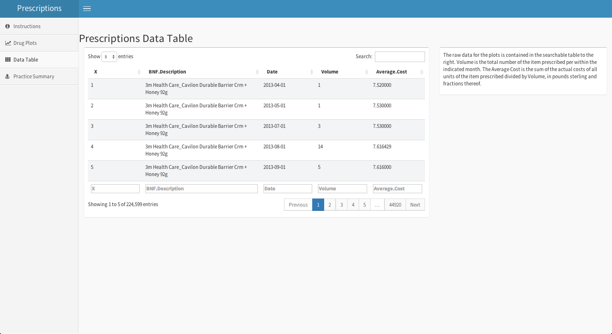
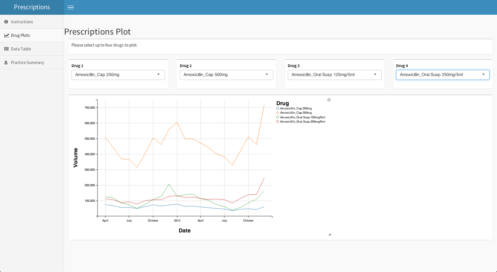
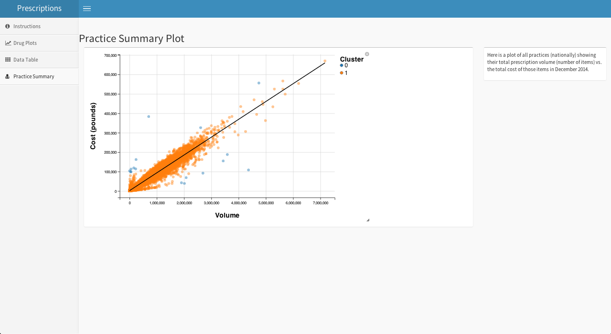

# Prescription Dashboard

Playing with [shinydashboard](http://rstudio.github.io/shinydashboard/) using some NHSBSA [prescription data](http://www.nhsbsa.nhs.uk/PrescriptionServices/3164.aspx).

Here are some screenshots. The dashboard in app2.R additionally shows timeseries
of the cost of drugs in a parallel chart below the volume chart.

